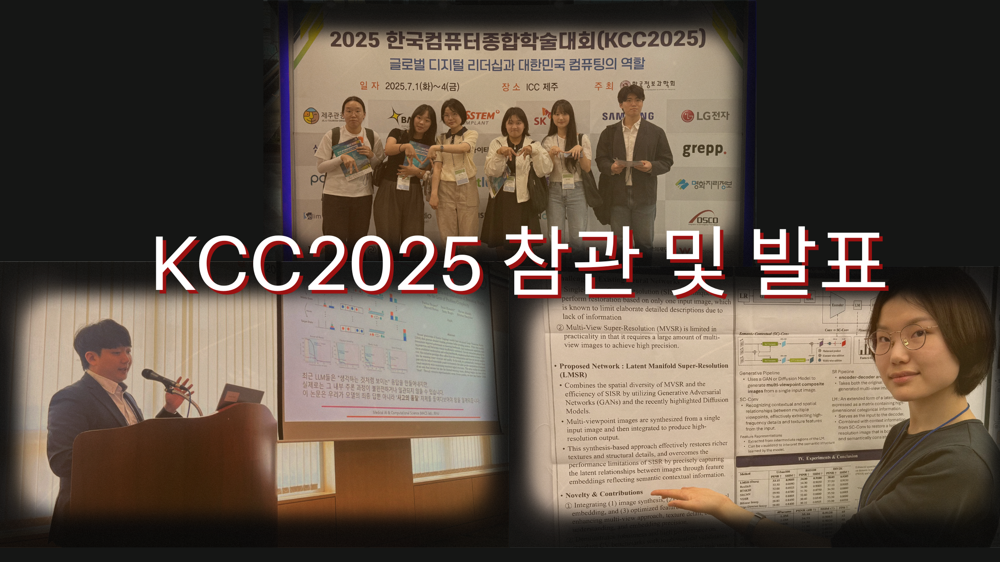

In July 2025, MACS Lab attended the Korea Computer Congress 2025 (KCC 2025) held at ICC Jeju. The team joined technical sessions, poster presentations, and workshops to share research outcomes and gain broader academic perspectives.

*MACS Lab at KCC 2025*

Professor Kyungsu Lee presented in the early-career researcher session under the topic **"Applications of Trustworthy AI"**, followed by active discussions with domestic and international participants.

Students in our integrated and graduate tracks also participated in poster and session programs, receiving valuable feedback and building new research connections.

- Conference Website: [https://www.kiise.or.kr/conference/kcc/2025/](https://www.kiise.or.kr/conference/kcc/2025/)
- Early-Career Session Program: [https://kcc2025.kiise.or.kr/Proceedings/chart.asp](https://kcc2025.kiise.or.kr/Proceedings/chart.asp)
