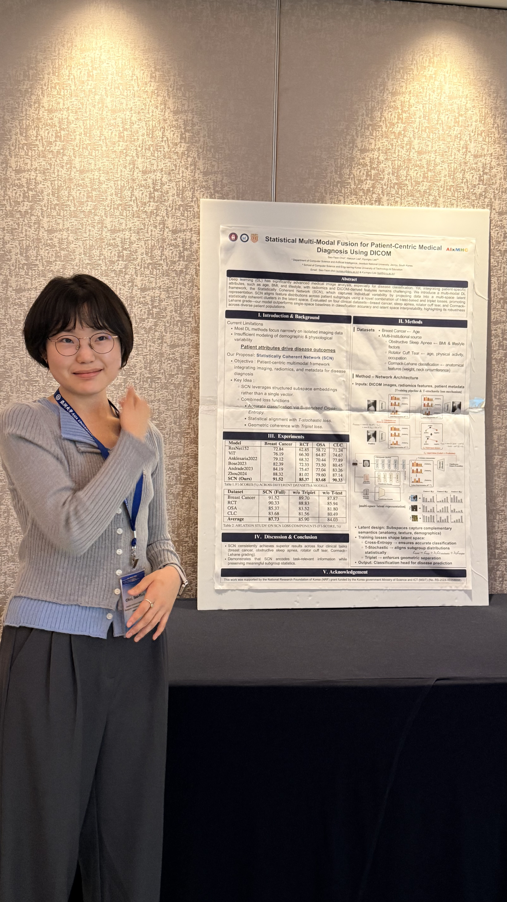

  

MacsLAB은 **AIxMHC 2025 (2025 Second International Conference on Artificial Intelligence for Medicine, Health, and Care)**에 참석해 두 편의 논문을 발표하고, 다양한 국제 연구자들과 활발히 교류했습니다.

*AIxMHC 2025 현장 (Taichung, Taiwan)*

  

---

  

### 발표 논문

1. **Statistical Multi-Modal Fusion for Patient-Centric Medical Diagnosis Using DICOM** (Poster)
2. **Statistical Latent Manifold-Guided Framework for Generative Super-Resolution** (Regular)

*발표 후 현장 질의응답 및 연구 토론*

*포스터 발표 현장*

  

AIxMHC 2025 참석을 통해 의료 AI 분야의 최신 연구 동향을 공유하고, 국제 협력 가능성을 확장하는 뜻깊은 시간을 가졌습니다.

- Conference Website: [https://chaoneng.github.io/aixmhc2025.github.io/](https://chaoneng.github.io/aixmhc2025.github.io/)
