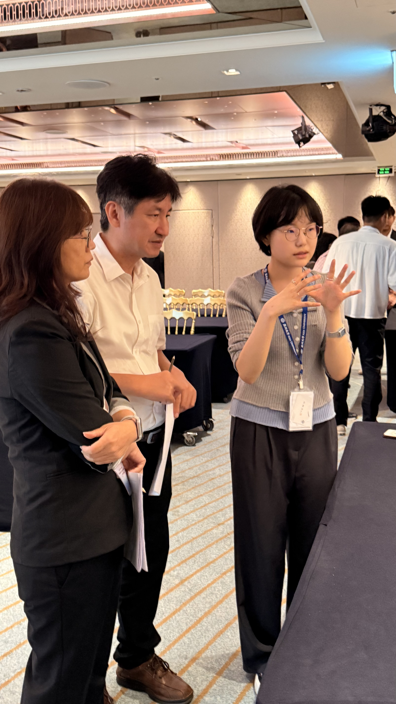
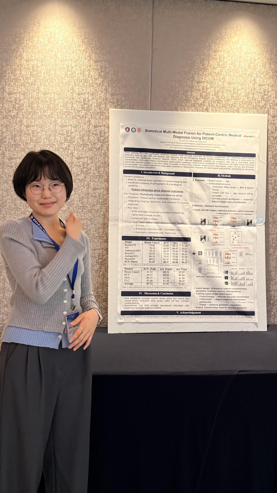

MACS Lab participated in **AIxMHC 2025 (The 2nd International Conference on Artificial Intelligence for Medicine, Health, and Care)** in Taichung, Taiwan. We presented two papers and discussed recent research trends in medical AI with international researchers.

*AIxMHC 2025, Taichung, Taiwan*

### Presented Papers

1. **Statistical Multi-Modal Fusion for Patient-Centric Medical Diagnosis Using DICOM** (Poster)
2. **Statistical Latent Manifold-Guided Framework for Generative Super-Resolution** (Regular)

*Q&A and technical discussion after the presentation*

*Poster presentation session*

The conference provided a valuable opportunity to exchange ideas on practical medical AI applications and to expand possibilities for international collaboration.

- Conference Website: [https://chaoneng.github.io/aixmhc2025.github.io/](https://chaoneng.github.io/aixmhc2025.github.io/)
