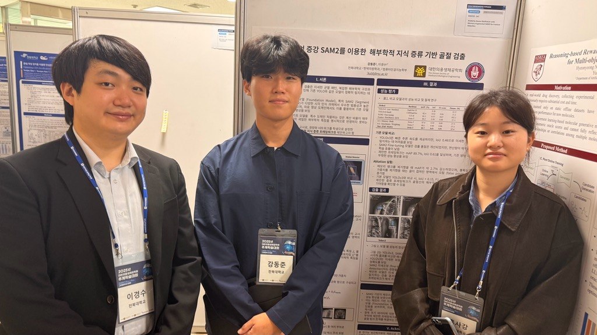
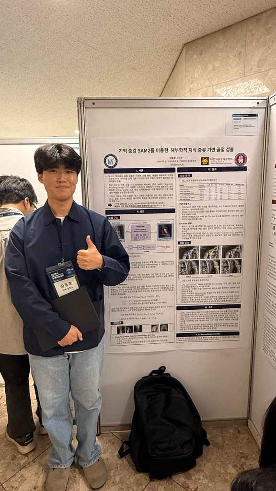
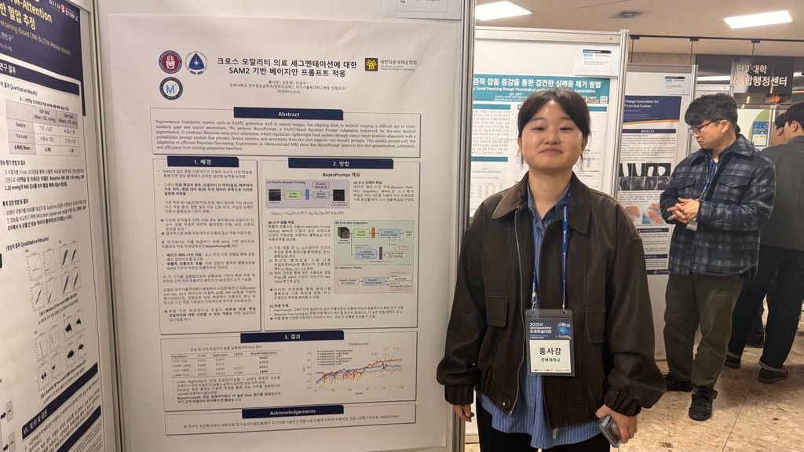

MACS Lab participated in the **Korean Society of Medical and Biological Engineering (KOSOMBE) 2025 Fall Conference** and presented our recent work in medical AI and medical image analysis.

*MACS Lab members at KOSOMBE 2025 Fall*

## Presentation 1

**Dongjun Kang (first author), Kyungsu Lee (corresponding author)**  
**Anatomy-Aware Distillation with Memory-Augmented SAM2 for Fracture Detection**  
KOSOMBE 2025 Fall (Poster 244)

This work proposes a memory-augmented knowledge distillation framework to transfer anatomy-aware knowledge from a large SAM2 model to a lightweight fracture detector.

*Poster 244 presentation*

- Related Publication: [/publication/0033-anatomy-aware-distillation-with-memory-augmented-sam2-for-fracture-detection/](/publication/0033-anatomy-aware-distillation-with-memory-augmented-sam2-for-fracture-detection/)

## Presentation 2

**Sakang Hong (first author), Jun-Yung Kim, Kyungsu Lee (corresponding author)**  
**SAM2-based Bayesian Prompt Adaptation for Cross-Modality Medical Segmentation**  
KOSOMBE 2025 Fall (Poster 247)

This work introduces a SAM2-based Bayesian prompt adaptation method (BayesPrompt) for cross-modality medical image segmentation under few-shot settings.

*Poster 247 presentation*

- Related Publication: [/publication/0034-sam2-based-bayesian-prompt-adaptation-for-cross-modality-medical-segmentation/](/publication/0034-sam2-based-bayesian-prompt-adaptation-for-cross-modality-medical-segmentation/)

The conference offered productive exchanges with researchers in biomedical engineering, especially on practical deployment paths for medical AI.

- Program: [https://www.kosombe.or.kr/register/2025_fall/program/sub07.html](https://www.kosombe.or.kr/register/2025_fall/program/sub07.html)
