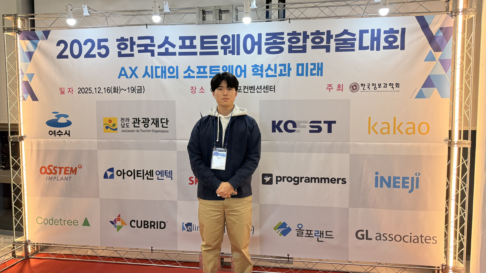
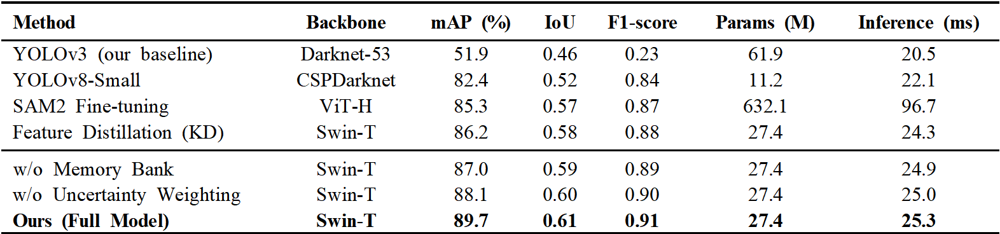

  

MacsLAB은 **KSC 2025 (한국소프트웨어종합학술대회)**에 참석하여 연구 성과를 발표하고, 다양한 연구자들과 최신 AI/소프트웨어 기술 동향을 공유했습니다.

*KSC 2025 현장 (강동준 학생)*

*KSC 2025 현장 (Kyungsu Lee)*

  

---

  

### 발표 논문

**강동준(1저자), Kyungsu Lee(교신저자)**  
**Anatomy-Aware Distillation with Memory-Augmented SAM2 for Fracture Detection**

제안한 방법은 SAM2 기반 교사-학생 구조와 메모리 증강 지식 증류를 결합해, 제한된 데이터 환경에서도 골절 검출의 정확도와 강건성을 높입니다.

*제안 방법 및 성능 요약*

- 관련 논문: [/publication/0038-anatomy-aware-distillation-with-memory-augmented-sam2-for-fracture-detection-ksc2025/](/publication/0038-anatomy-aware-distillation-with-memory-augmented-sam2-for-fracture-detection-ksc2025/)
- 학회 링크: [https://www.kiise.or.kr/conference/KSC/2025/](https://www.kiise.or.kr/conference/KSC/2025/)
