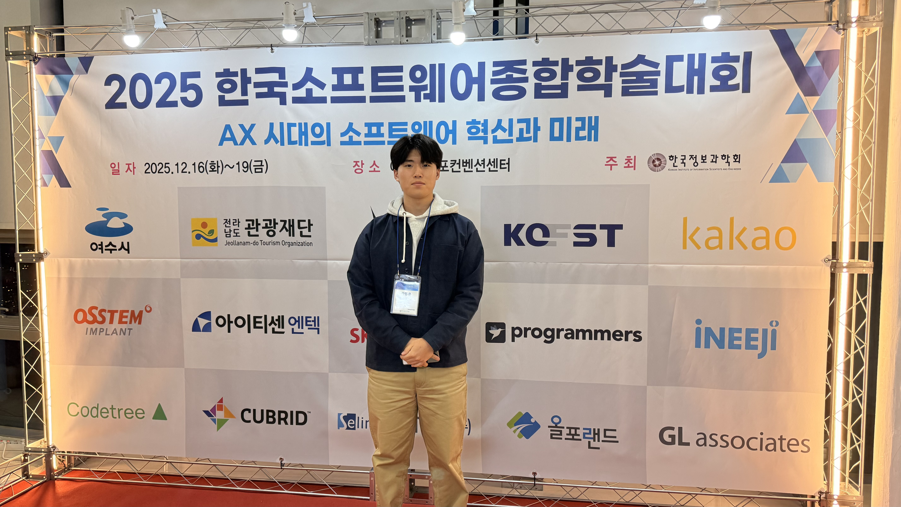
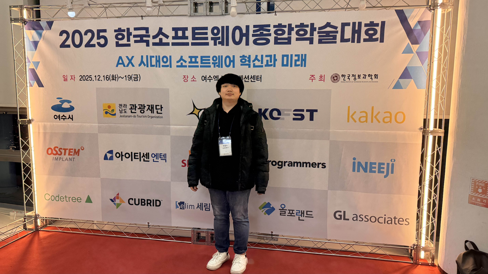
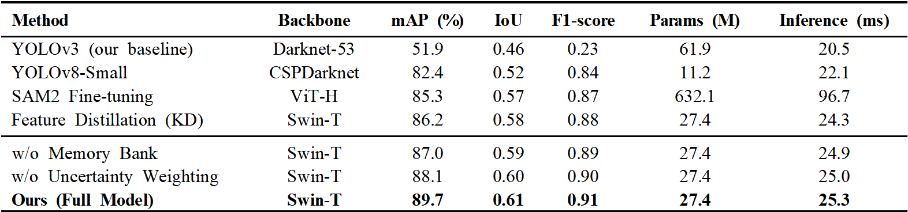

MACS Lab attended **KSC 2025 (Korea Software Congress)** to present our work and discuss recent trends in AI and software systems with researchers across academia and industry.

*KSC 2025 on-site photo (Dongjun Kang)*

*KSC 2025 on-site photo (Kyungsu Lee)*

### Presented Work

**Dongjun Kang (first author), Kyungsu Lee (corresponding author)**  
**Anatomy-Aware Distillation with Memory-Augmented SAM2 for Fracture Detection**

The proposed approach combines a SAM2-based teacher-student structure with memory-augmented distillation to improve fracture detection accuracy and robustness under limited-data conditions.

*Method overview and key results*

- Related Publication: [/publication/0038-anatomy-aware-distillation-with-memory-augmented-sam2-for-fracture-detection-ksc2025/](/publication/0038-anatomy-aware-distillation-with-memory-augmented-sam2-for-fracture-detection-ksc2025/)
- Conference Website: [https://www.kiise.or.kr/conference/KSC/2025/](https://www.kiise.or.kr/conference/KSC/2025/)
