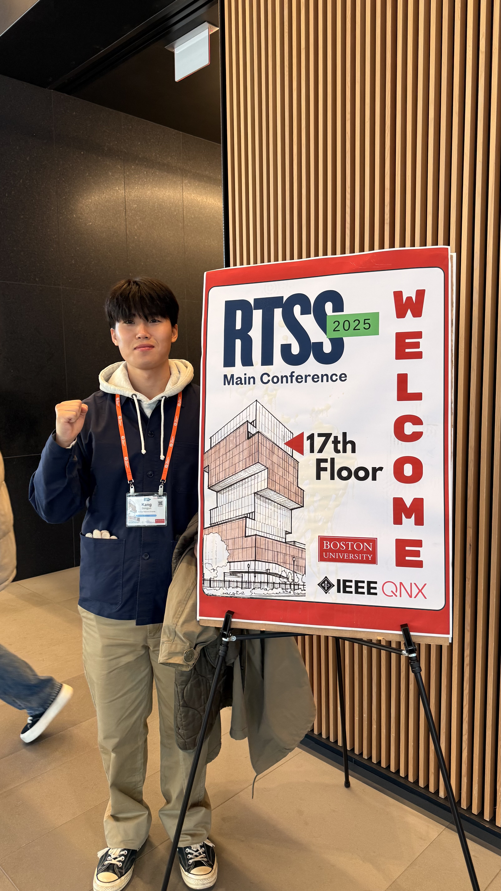

  

MacsLAB은 **RTSS 2025 (IEEE Real-Time Systems Symposium)**에 참석하여, 최신 실시간 시스템 및 AI 시스템 관련 연구 동향을 폭넓게 살펴보고 다양한 연구자들과 교류했습니다.

*RTSS 2025 메인 컨퍼런스 세션 현장*

  

---

  

학회 기간 동안 키노트/세션/포스터를 참관하며 실시간 시스템 분야의 최신 이슈와 연구 흐름을 파악했고, 향후 연구 방향에 대한 아이디어를 구체화하는 데 의미 있는 시간을 가졌습니다.

*RTSS 2025 행사 안내 보드 앞 (최서연 학생)*

*RTSS 2025 행사 안내 보드 앞 (강동준 학생)*

*RTSS 2025 행사 안내 보드 앞 (Kyungsu Lee)*

  

---

  

보스턴 현지에서 학회장 주변 환경과 연구 커뮤니티 분위기를 직접 경험하며, 국제 학술 교류의 중요성을 다시 확인할 수 있었습니다.

*RTSS 2025 참석 기간 중 보스턴 전경*

  

- Conference Website: [https://2025.rtss.org/](https://2025.rtss.org/)
