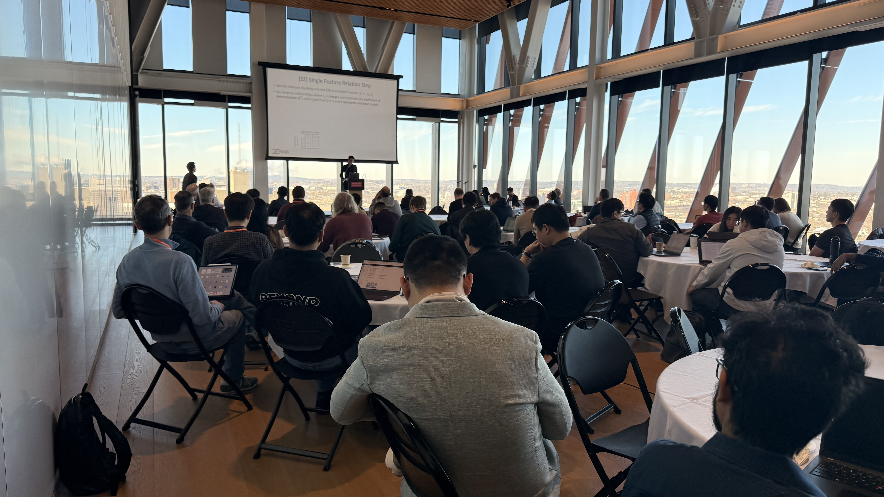
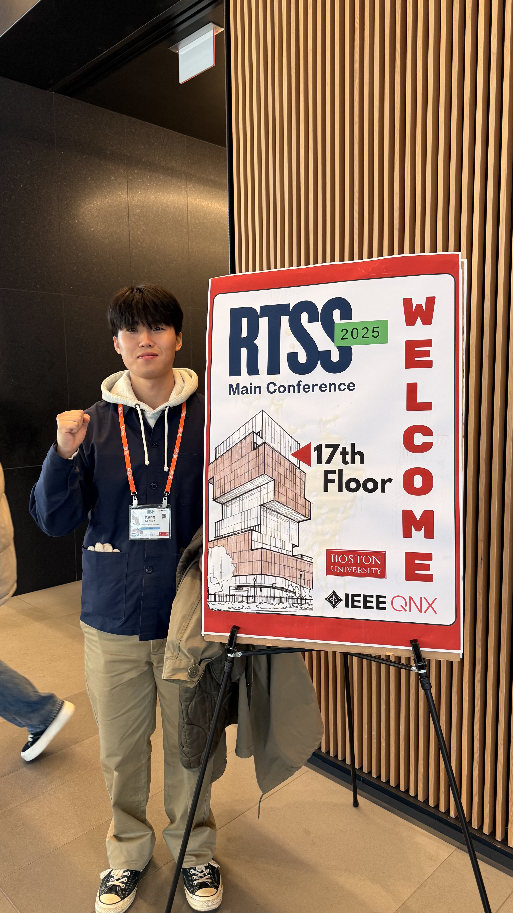
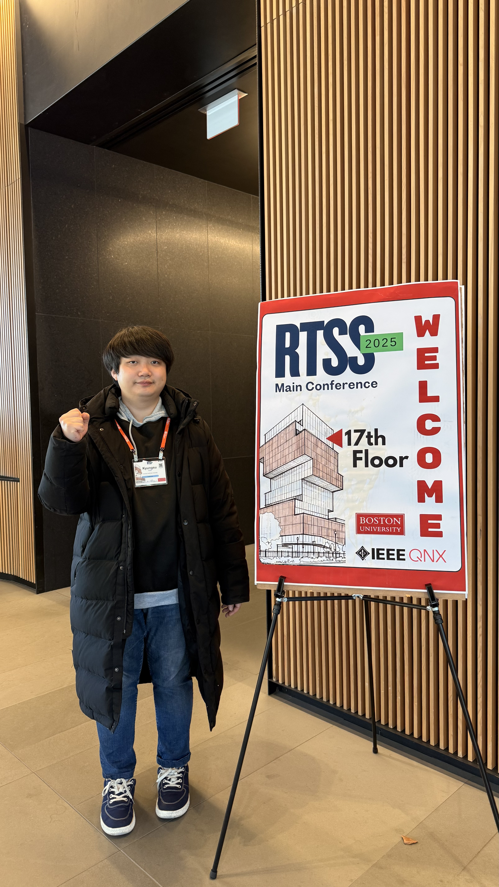
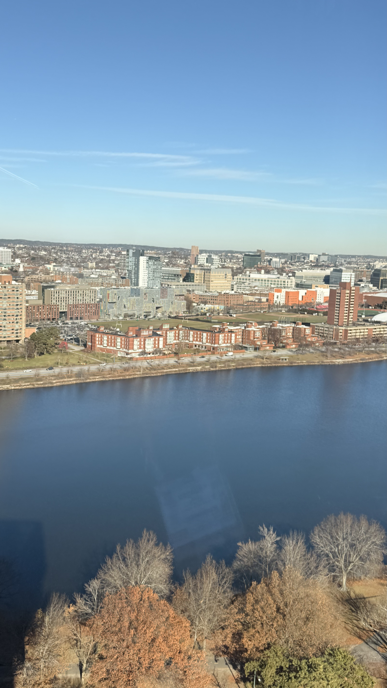

MACS Lab attended **RTSS 2025 (IEEE Real-Time Systems Symposium)** in Boston and explored recent advances in real-time systems and AI system design through keynote talks, technical sessions, and poster presentations.

*Main conference session at RTSS 2025*

During the conference, we reviewed active topics in real-time intelligence and system-level reliability, and discussed potential directions for future cross-disciplinary research.

*At the RTSS 2025 venue (Seoyeon Choi)*

*At the RTSS 2025 venue (Dongjun Kang)*

*At the RTSS 2025 venue (Kyungsu Lee)*

The trip also provided meaningful exposure to the broader international research community and collaboration landscape.

*Boston during RTSS 2025*

- Conference Website: [https://2025.rtss.org/](https://2025.rtss.org/)
