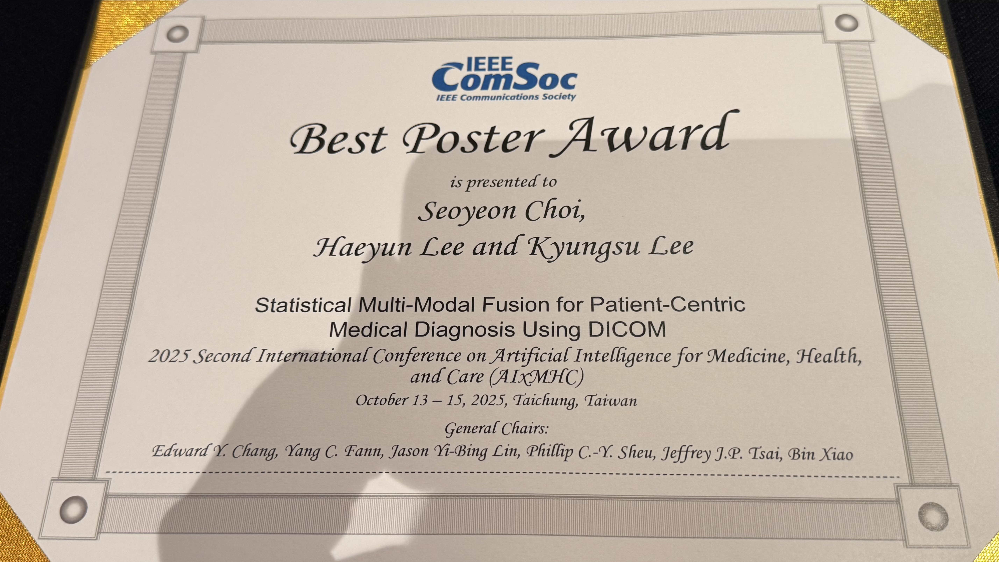
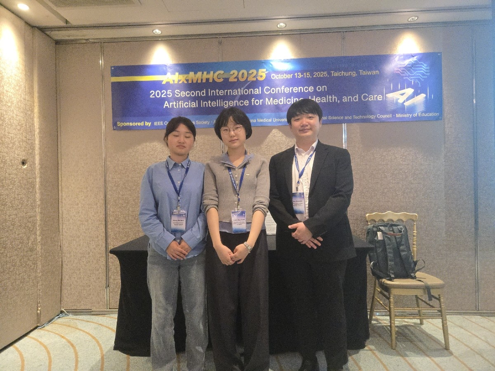

Congratulations!

The team of **Seo-Yeon Choi, Haeyun Lee, and Kyungsu Lee** from MacsLAB won the **Best Poster Award** at **AIxMHC 2025**.

The award-winning paper is:

- **Statistical Multi-Modal Fusion for Patient-Centric Medical Diagnosis Using DICOM**

*AIxMHC 2025 Best Poster Award Certificate*

*AIxMHC 2025 Team Photo*

*Poster Presentation Scene*

MacsLAB will continue to strive for clinically meaningful research achievements in the field of medical AI.

Related Links:
- [/publication/0036-statistical-multi-modal-fusion-for-patient-centric-medical-diagnosis-using-dicom/](/publication/0036-statistical-multi-modal-fusion-for-patient-centric-medical-diagnosis-using-dicom/)
- [AIxMHC 2025](https://chaoneng.github.io/aixmhc2025.github.io/)