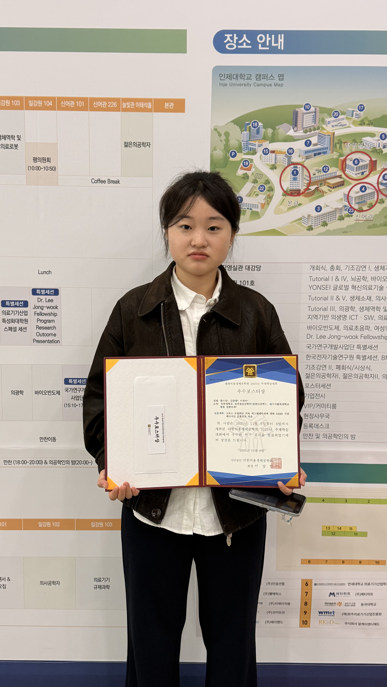
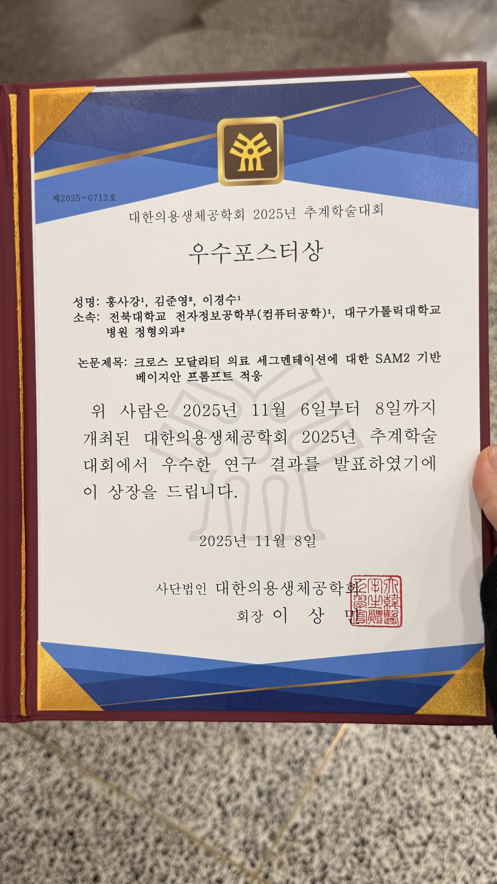

Congratulations!

**Sagang Hong**, a Master's student at MacsLAB, won the **Best Poster Award** at the **2025 Fall Conference of the Korean Society of Medical and Biological Engineering (KOSOMBE)**.

This achievement recognizes his outstanding research presented at the conference held from November 6 to 8, 2025, at Inje University (Gimhae).

*KOSOMBE 2025 Fall Conference Award Ceremony*

*Best Poster Award Certificate for Sagang Hong*

Award-winning Paper Information:

- **Sagang Hong (1st author), Junyoung Kim, Kyungsu Lee (Corresponding author)**
- **SAM2-based Bayesian Prompt Adaptation for Cross-Modality Medical Segmentation**

We sincerely congratulate Sagang Hong on his award and look forward to more excellent research achievements from MacsLAB.

Related Links:
- [/publication/0034-sam2-based-bayesian-prompt-adaptation-for-cross-modality-medical-segmentation/](/publication/0034-sam2-based-bayesian-prompt-adaptation-for-cross-modality-medical-segmentation/)
- [KOSOMBE 2025 Fall Conference Program](https://www.kosombe.or.kr/register/2025_fall/program/sub07.html)