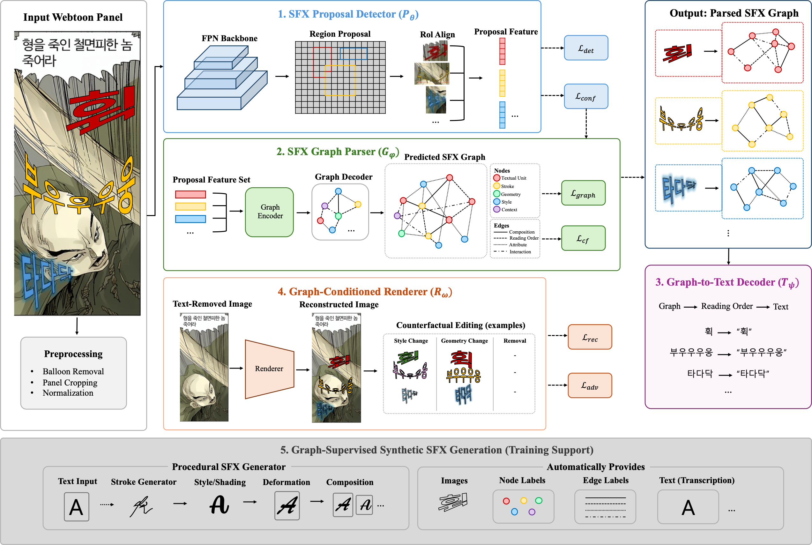
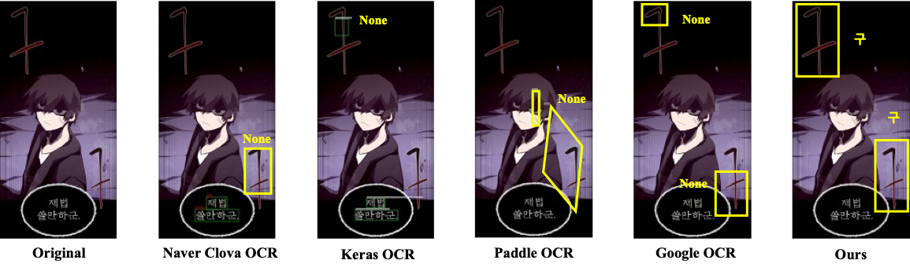

### Framework Overview

*Figure 3 from the paper. SFXGraph represents stylized sound effects as structured graphs and uses graph-conditioned rendering and synthetic supervision to support recognition.*

### Recognition Results

*Figure 4 from the paper. From left to right: original panel, Naver Clova OCR, Keras OCR, Paddle OCR, Google OCR, and SFXGraph. Bounding boxes and transcriptions show detection and recognition outputs; "None" indicates a missed detection.*
