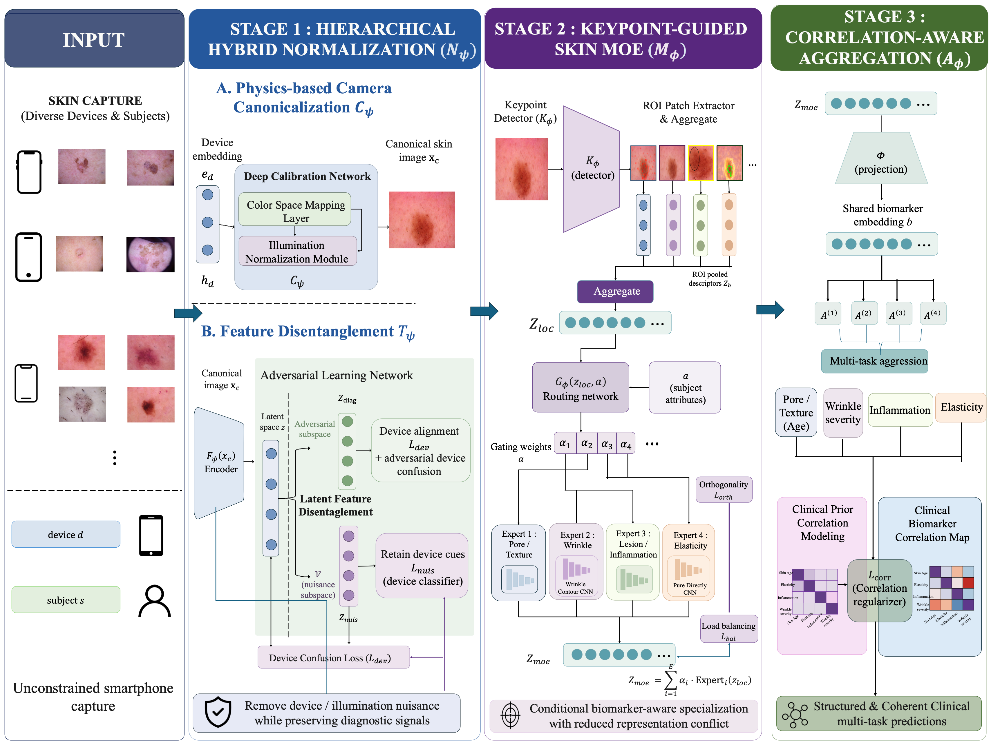

### Framework Overview

*Figure 1 from the paper. The framework combines device and illumination normalization, biomarker-specific expert routing, and clinically constrained evidence aggregation for personalized skin diagnosis.*
