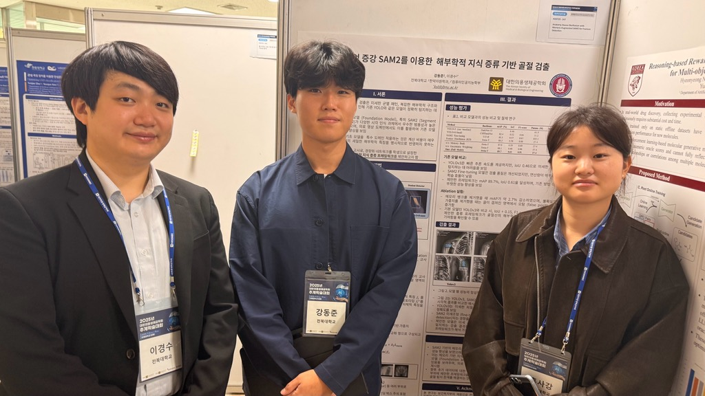
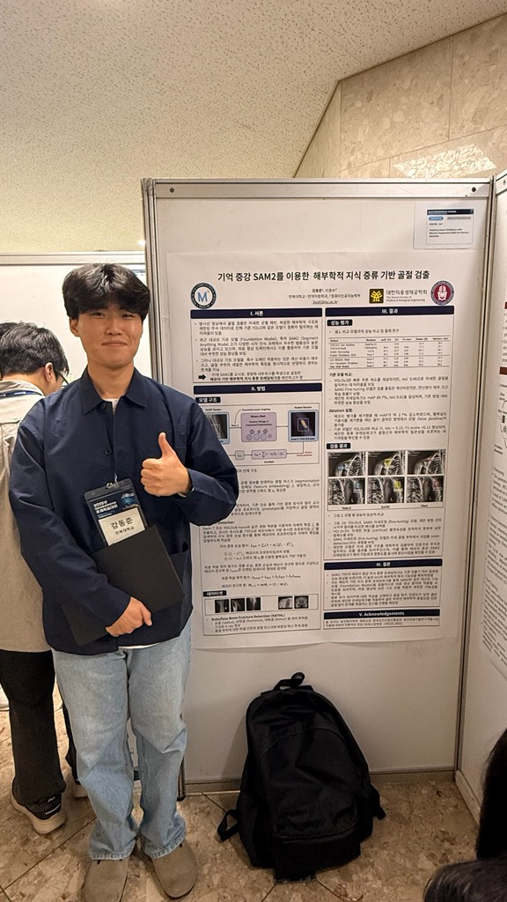

  

MacsLAB은 **대한의용생체공학회 2025 추계학술대회(KOSOMBE 2025 Fall)**에 참석하여, 의료 AI 및 의료영상 분석 관련 연구 성과를 발표했습니다.

이번 학회에서는 석사과정 학생들이 **1저자**로 발표를 진행하고, **Kyungsu Lee(이경수 교수)**가 교신저자로 참여했습니다.

*KOSOMBE 2025 Fall 현장에서의 MacsLAB 단체 사진*

  

---

  

## 발표 1

**강동준(1저자), Kyungsu Lee(교신저자)**  
**Anatomy-Aware Distillation with Memory-Augmented SAM2 for Fracture Detection**  
대한의용생체공학회 2025 추계학술대회 (Poster 244)

본 연구는 골절 검출에서 대규모 분할 모델(SAM2)의 해부학적 지식을 경량 모델로 효율적으로 전달하기 위해, 메모리 증강 기반 지식 증류 프레임워크를 제안합니다.

*강동준 학생의 Poster 244 발표 현장*

- 관련 논문: [/publication/0033-anatomy-aware-distillation-with-memory-augmented-sam2-for-fracture-detection/](/publication/0033-anatomy-aware-distillation-with-memory-augmented-sam2-for-fracture-detection/)

  

---

  

## 발표 2

**홍사강(1저자), Jun-Yung Kim, Kyungsu Lee(교신저자)**  
**SAM2-based Bayesian Prompt Adaptation for Cross-Modality Medical Segmentation**  
대한의용생체공학회 2025 추계학술대회 (Poster 247)

본 연구는 소수 샘플 환경의 교차 모달 의료영상 분할 문제를 해결하기 위해, SAM2 기반 베이지안 프롬프트 적응(BayesPrompt) 방법을 제안합니다.

*홍사강 학생의 Poster 247 발표 현장*

- 관련 논문: [/publication/0034-sam2-based-bayesian-prompt-adaptation-for-cross-modality-medical-segmentation/](/publication/0034-sam2-based-bayesian-prompt-adaptation-for-cross-modality-medical-segmentation/)

  

---

  

학회 현장에서 다양한 의료공학 연구자들과 교류하며, 연구의 실용성과 확장 가능성에 대해 유익한 논의를 진행했습니다. MacsLAB은 앞으로도 의료 AI 분야의 학술 활동을 지속적으로 이어가겠습니다.

  

- 학회 프로그램: [https://www.kosombe.or.kr/register/2025_fall/program/sub07.html](https://www.kosombe.or.kr/register/2025_fall/program/sub07.html)
